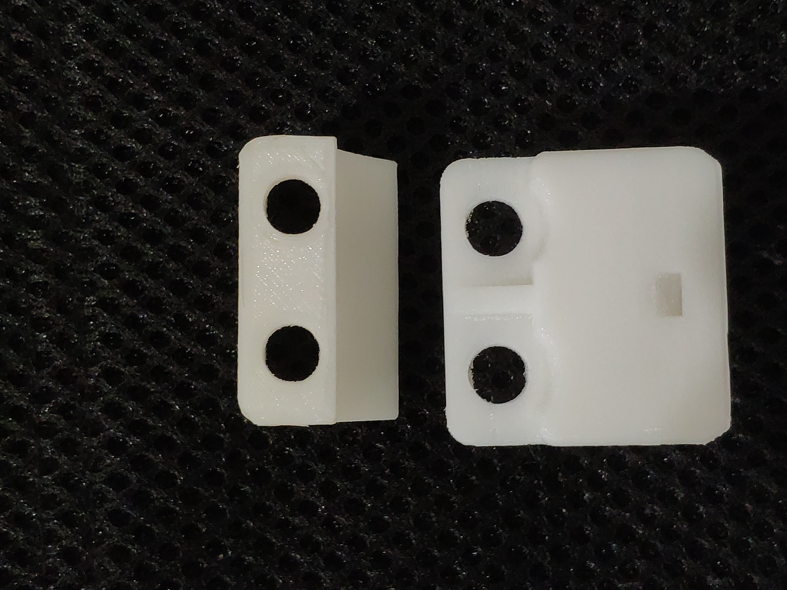

# EVカート　カスタマイズのすすめ　メカ編
## スイッチ・ボックス
### 3Dプリント用のデータを公開
　編集部では，CQインバータ・キットに付属のトグル・スイッチを，カートのフレームに固定する部品を3Dプリンタで作りました．CADはCreoを使いました．
　3Dプリンタで部品を印刷するためのSTLデータを公開するのでご自由にご利用ください．3Dプリンタをお持ちでない方は，DMMなどの有料3Dプリントサービスを利用すれば部品を作れます．
　少ないサポート材で印刷できるようにデータを工夫してありますので，ご自分で印刷する場合は，造形方向を調整してください．

### 使い方
　部品は2ピース（2分割）となっています．分割された2つの部品を固定するにはトグル・スイッチの薄い6角ナットを利用します．つまりトグル・スイッチの固定と，分割された部品の固定を同時に行うようになっています．
　インシュロック（タイラップ）を通すための角穴を用意してあるので，角パイプへの固定に不安がある場合や，配線をまとめたい場合に利用してください．

### ダウンロード・データ
[部品1](swb_p1.stl)
[部品2](swb_p2.stl)

### 参考写真

